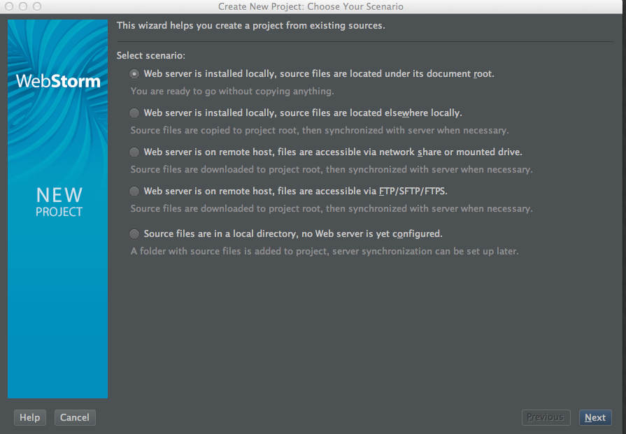

In this documentation, I will show you how to setup a cocos2d-html5 development environment on MacOS 10.9 -- Yeah! The Maverics.

# Prerequisites

To follow this tutorials, you should be familiar with the software package  installation process of MacOS.

Don't worry, the process is deadly simple.

Most of the time, the process is something like that:

- Download the DMG.

- Double click to open it.

- Drag and drop the xxx.app to your /Application directory.

In this documentation, I will omit the very details of each software package's installation process.

# Preparation -- Download the required software packages

1. Download and install WebStorm 7. The current stable release of [WebStorm 7](http://www.jetbrains.com/webstorm/download/index.html) is 7.02. 

2. Download cocos2d-html5 v2.2 from the offical website of cocos2d-x. Here is the [Link](http://cocos2d-x.org/download ) .

After you downloaded the cocos2d-html v2.2. You should unzip it to a proper location. In our case, I unzip it at ~/workspace/cocos2d-html5.

The ~ simbol represents your home directory path, which in our case is /Users/guanghui. 

**Note:** You can also get the cutting edge version of cocos2d-html5 through github. Here is the [cocos2d-html5 github repository](https://github.com/cocos2d/cocos2d-html5 ) .

The active development work are done in **develop** branch.

3. Download and install Chrome 30 and the [JetBrains-IDE-support ]( https://chrome.google.com/webstore/detail/jetbrains-ide-support/hmhgeddbohgjknpmjagkdomcpobmllji)  extension.

**Note**

1. Don't try to get the latest beta version of Chrome. Some WebGL APIs has changed and you will suffer the API change problems.

2. Since the current stable release of Chrome is 31.0.1650.57. But it doesn't work well with cocos2d-html5-v2.2. If you do want to use this version due to some
mandatory reasons, you should refer to [this post ](http://www.cocos2d-x.org/forums/19/topics/39063 ) for more information.

In the near future, the cocos2d-html5 team will release a new version and you don't need to hack the source code again to work with Chrome 31.
 
All right, let's see how to configure WebStorm 7.1 to develop and debug our cocos2d-html5 applications.

# Configure WebStorm to load cocos2d-html5 and enable auto-complete

- unzip cocos2d-html5-v2.2.zip
- Create New Project From Existing Files

Click **Project ROOt** To set the default project root.

Update Chrome to 30 and install the WebStorm plugin.

It is very important to specify the correct version of chrome.

